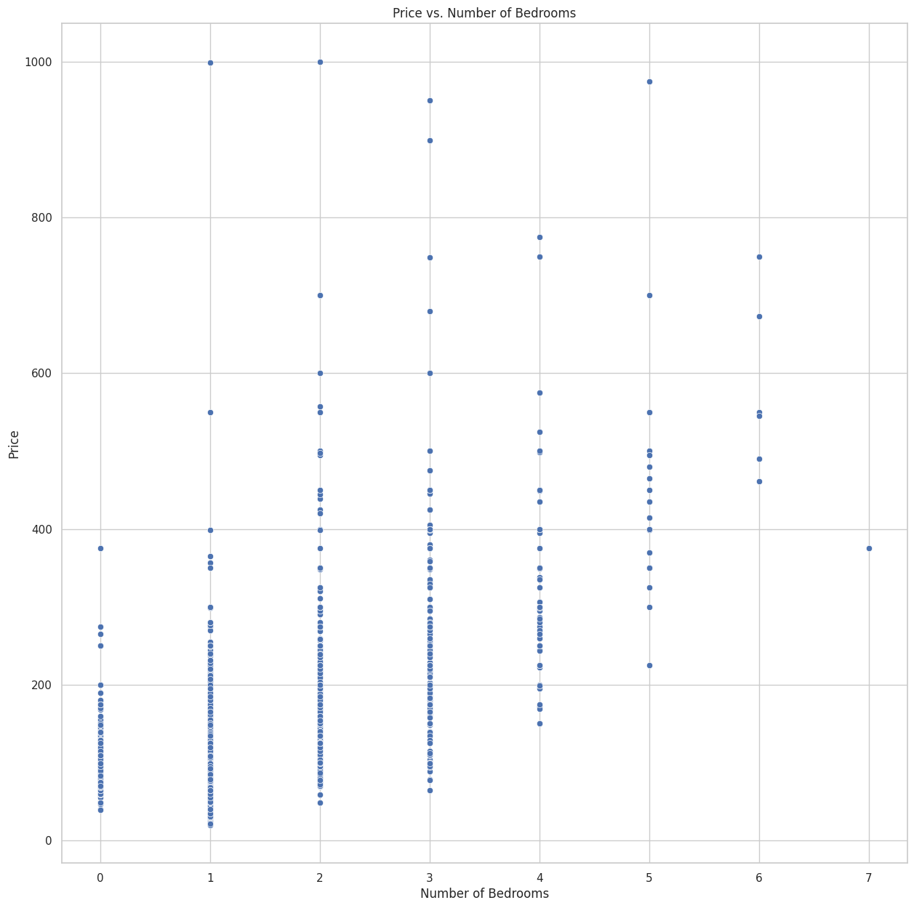
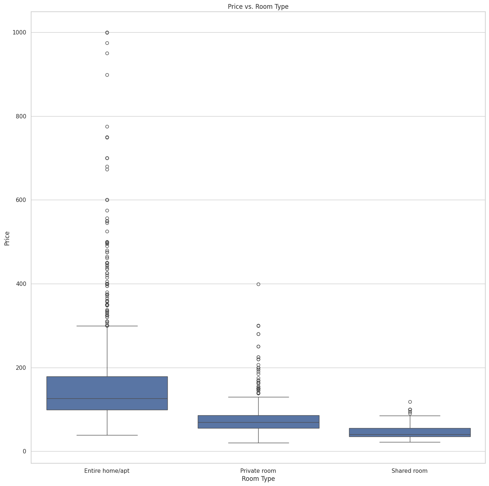
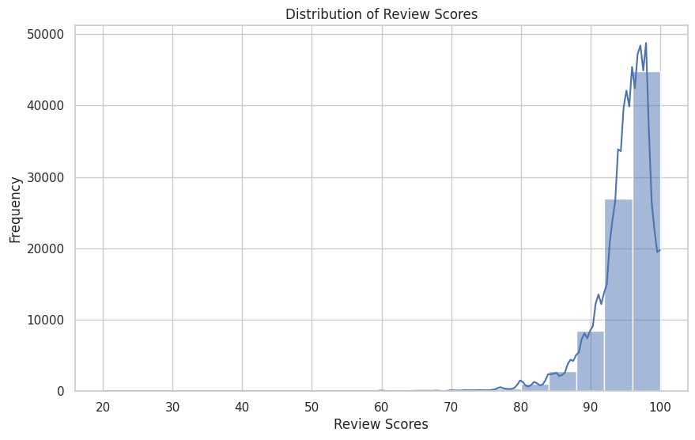
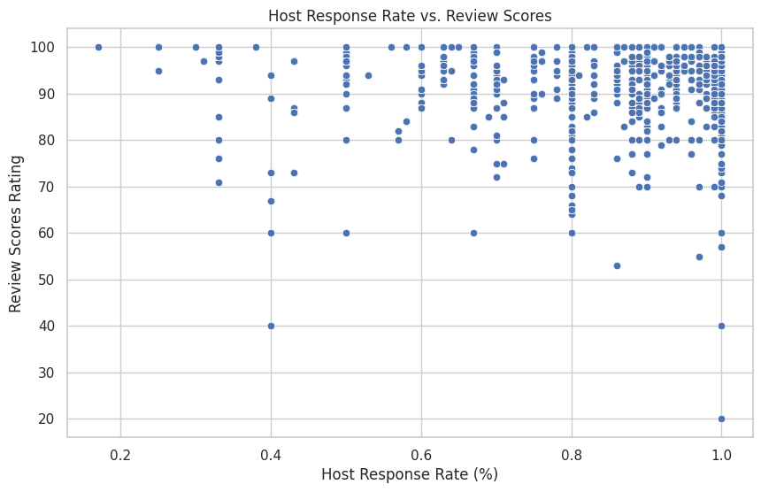

# Welcome to My Blog, in this blog, we will show you to:
# understanding the Seattle Airbnb Market: Key Insights

## **Introduction**

The Airbnb market in Seattle is a bustling and dynamic space. With thousands of listings, both hosts and guests are looking for ways to optimize their experiences. This analysis dives into three critical questions to uncover the key factors that make an Airbnb listing successful. We will explore what drives pricing, guest satisfaction, and overall success, providing insights that are valuable for hosts, guests, and potential investors alike.

## **Question 1: What Aspects Are Most Determinant of the Price of an Airbnb Listing in Seattle?**

### **Explanation**

Pricing is a crucial factor for both hosts and guests. Our analysis reveals that the type of property, the number of bedrooms and bathrooms, and the location (neighborhood) play significant roles in determining the price of a listing. Seasonal demand also impacts pricing, with prices generally higher during peak tourist seasons.

### **Visualization**

**Price** versus number of **Bedrooms**

**Price** versus type of **Room**

**Price** versus **Neighborhood**

## **Question 2: What Are the Key Factors Influencing Guest Reviews and Ratings for Airbnb Listings in Seattle?**

### **Explanation**

Guest reviews and ratings are essential for building trust and attracting more bookings. Our findings show that the cleanliness of the property, accuracy of the listing description, and the responsiveness of the host are the most influential factors. These elements significantly contribute to higher ratings and positive reviews.

### **Visualization**

**Guest Reviews**

## **Question 3: What Is the Impact of Host Attributes on the Success of Airbnb Listings in Seattle?**

### **Explanation**

Hosts who are responsive and have multiple listings tend to have more successful properties. Experience matters too—hosts who have been on the platform longer generally have better occupancy rates and reviews. These attributes suggest that experienced and active hosts are better at managing their listings to meet guest expectations.

### **Visualization**

**Host success factors**

## **Conclusion**

Our analysis sheds light on the key drivers of success in the Seattle Airbnb market. Pricing is influenced by property characteristics and seasonality, guest satisfaction hinges on cleanliness and host responsiveness, and host experience plays a critical role in the success of listings. For hosts looking to optimize their listings, focusing on these factors can lead to improved performance and profitability.

For those interested in the detailed analysis and methodology, you can view the full technical notebook on GitHub [here](https://github.com/hideonhp/airbnb-analysis).
